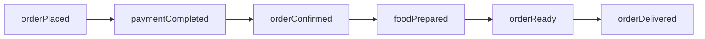
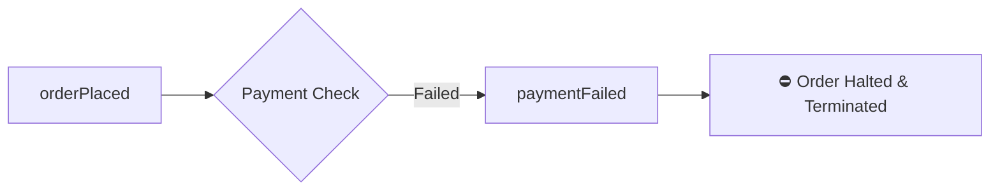
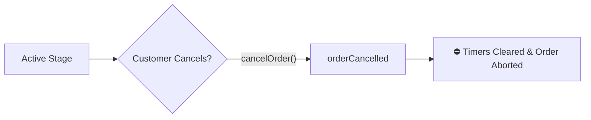
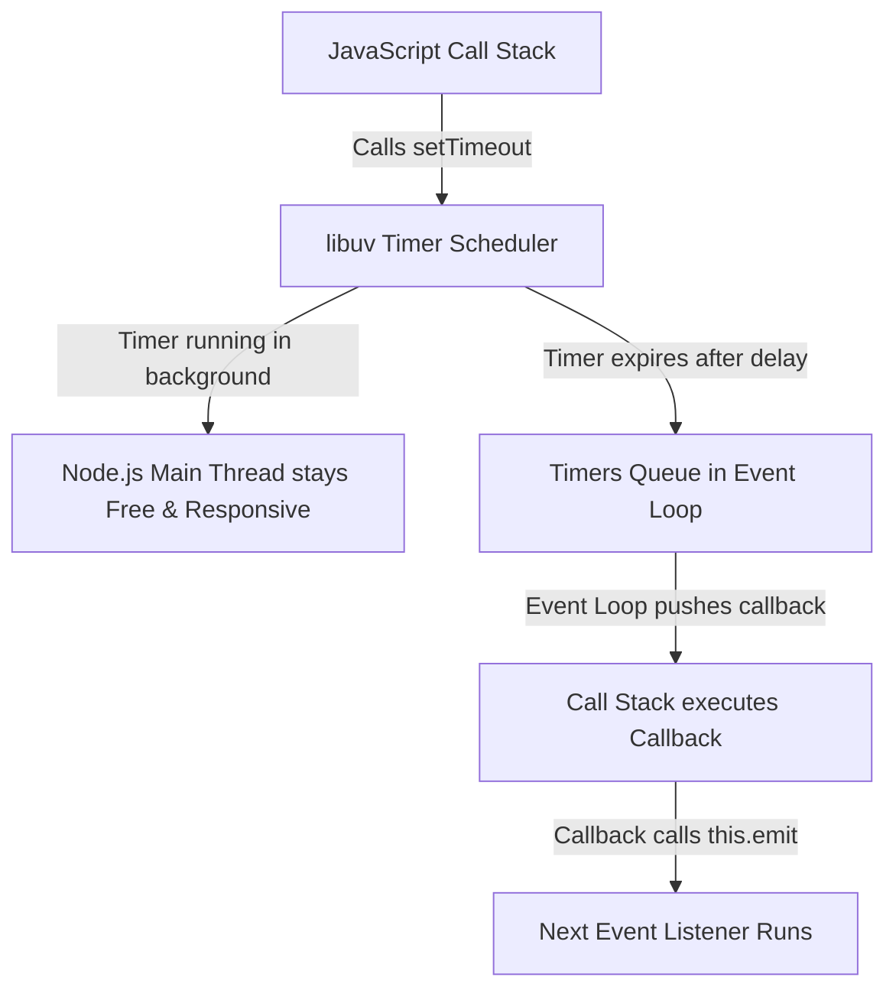

# 🍔 Event-Driven Food Ordering System

> **Full-Stack Development (FSD) Lab Assignment**  
> A complete Node.js mini-application demonstrating **Event-Driven Architecture (EDA)**, **Custom EventEmitter**, **Asynchronous Chaining**, and the **Node.js Event Loop**.

---

## 📌 1. Project Overview

The **Event-Driven Food Ordering System** simulates the complete real-world lifecycle of an online food delivery service (such as UberEats, DoorDash, or Zomato) using pure Node.js. 

Instead of writing a single, tightly coupled monolithic function to handle order placement, payment, kitchen preparation, packaging, and delivery, this project utilizes **Node.js's built-in `EventEmitter`** class. Each stage of the lifecycle is completely decoupled, reacting to published events and triggering subsequent phases asynchronously via timers (`setTimeout`).

---

## ✨ 2. Key Features

- **Custom EventEmitter Class**: `FoodOrder` extends `EventEmitter` from Node.js's built-in `events` module.
- **Event-Driven Lifecycle**: Workflow stages communicate purely via `.emit()` and `.on()` listeners.
- **Asynchronous Processing**: Simulates real-world delays (payment processing, cooking, courier transit) using non-blocking `setTimeout()`.
- **Payment Failure Handling**: Gracefully catches payment rejections and prevents downstream kitchen/delivery execution.
- **Order Cancellation Support**: Allows customers to cancel active orders in flight (`cancelOrder()`), immediately clearing pending timers and halting further processing.
- **Strict State Management**: State guards prevent invalid transitions (e.g., `cancelled -> delivered` or `payment_failed -> orderConfirmed`).
- **Clean Terminal Logging**: Rich, formatted logs with live timestamps, order IDs, and status transitions.
- **Zero External Dependencies**: Pure Node.js runtime code for lightweight, fast, and native execution.

---

## 🛠️ 3. Tech Stack

- **Runtime**: [Node.js](https://nodejs.org/) (v14.x or higher)
- **Language**: JavaScript (ES6+ / CommonJS)
- **Core Module**: Node.js built-in `events` (`EventEmitter`)
- **Asynchronous Mechanisms**: `setTimeout()`, `Promise`, `async/await`
- **Version Control**: Git & GitHub

---

## 📂 4. Project Structure

```text
FSD_ASSIGNMENTS/
│
├── event-driven-food-order/
│   ├── src/
│   │   ├── FoodOrder.js     # Core class extending EventEmitter with lifecycle logic
│   │   └── app.js           # Entry point executing the 3 demonstration scenarios
│   ├── .gitignore           # Ignores node_modules, logs, and OS files
│   ├── package.json         # Project metadata and start script
│   └── README.md            # Comprehensive documentation & architecture guide
│
└── README.md                # Root repository README
```

---

## 🔄 5. Event Lifecycle & Workflow

### 🟢 Successful Order Lifecycle (Happy Path)



1. **`orderPlaced`**: Customer initiates the order; system starts payment verification.
2. **`paymentCompleted`**: Payment is approved; order is dispatched to the restaurant.
3. **`orderConfirmed`**: Restaurant confirms order and notifies the kitchen.
4. **`foodPrepared`**: Kitchen completes cooking; food is packaged and sealed.
5. **`orderReady`**: Delivery partner arrives, picks up the package, and starts transit.
6. **`orderDelivered`**: Package arrives at the customer's address; order is completed successfully.

---

### 🔴 Failure & Cancellation Flows

#### 1. Payment Failure


#### 2. Order Cancellation (During In-Flight Processing)


---

## 🚀 6. Installation & Execution

### Prerequisites
- Make sure [Node.js](https://nodejs.org/) (version 14 or above) is installed on your system.

### Step 1: Clone the Repository
```bash
git clone https://github.com/Sakshamverma0193/FSD_ASSIGNMENTS.git
```

### Step 2: Navigate to the Project Directory
```bash
cd FSD_ASSIGNMENTS/event-driven-food-order
```

### Step 3: Run the Application
```bash
npm start
```
*(Or directly run: `node src/app.js`)*

---

## 📋 7. Expected Terminal Output

When you execute `npm start`, the application runs **3 sequential test scenarios** demonstrating the complete event system:

```text
###########################################################################
#                  🍔 EVENT-DRIVEN FOOD ORDERING SYSTEM 🍕                #
#              Full-Stack Development (FSD) Assignment Demo               #
###########################################################################

===========================================================================
SCENARIO 1: SUCCESSFUL FOOD ORDER
Description: Customer places an order, payment succeeds, kitchen prepares food, and it gets delivered.
===========================================================================
[23:54:20] [ORDER 101] EVENT: orderPlaced      | Order placed for [Cheeseburger, Crispy French Fries, Cold Soda] (Total: $25.50)
[23:54:20] [ORDER 101] Processing payment...
[23:54:21] [ORDER 101] EVENT: paymentCompleted | Payment of $25.50 received successfully.
[23:54:21] [ORDER 101] Sending order details to the restaurant...
[23:54:21] [ORDER 101] EVENT: orderConfirmed   | Restaurant accepted and confirmed the order.
[23:54:21] [ORDER 101] Kitchen started preparing items...
[23:54:23] [ORDER 101] EVENT: foodPrepared     | Food is freshly cooked and packed.
[23:54:23] [ORDER 101] Assigning delivery partner...
[23:54:23] [ORDER 101] EVENT: orderReady       | Order picked up by delivery partner.
[23:54:23] [ORDER 101] Rider is on the way to the customer address...
[23:54:25] [ORDER 101] EVENT: orderDelivered   | Order handed over to customer.
[23:54:25] [ORDER 101] >>> ORDER COMPLETED SUCCESSFULLY! Enjoy your meal! <<<


===========================================================================
SCENARIO 2: PAYMENT FAILURE HANDLING
Description: Customer places an order, but payment fails due to insufficient balance. Order stops immediately.
===========================================================================
[23:54:26] [ORDER 102] EVENT: orderPlaced      | Order placed for [Margherita Pizza, Stuffed Garlic Bread] (Total: $18.00)
[23:54:26] [ORDER 102] Processing payment...
[23:54:27] [ORDER 102] EVENT: paymentFailed    | Payment failed (Insufficient funds or card declined). Order halted.
[23:54:27] [ORDER 102] >>> ORDER TERMINATED: Please retry with a valid payment method. <<<


===========================================================================
SCENARIO 3: CUSTOMER ORDER CANCELLATION
Description: Customer places an order, but cancels it during payment/processing. Subsequent stages are aborted.
===========================================================================
[23:54:28] [ORDER 103] EVENT: orderPlaced      | Order placed for [Club Sandwich, Hot Espresso Coffee] (Total: $12.00)
[23:54:28] [ORDER 103] Processing payment...
[23:54:28] [ORDER 103] EVENT: orderCancelled   | Order cancelled (Customer changed mind / ordered by mistake). Processing halted.
[23:54:28] [ORDER 103] >>> ORDER CANCELLED: Refund initiated if applicable. <<<

===========================================================================
SIMULATION SUMMARY & LIFECYCLE VERIFICATION
===========================================================================
✓ Order 101 Final State: [DELIVERED] -> Reached delivery smoothly.
✓ Order 102 Final State: [PAYMENT_FAILED] -> Halted safely after payment failure.
✓ Order 103 Final State: [CANCELLED] -> Halted safely upon customer cancellation.
===========================================================================
Demonstration completed successfully!
```

---

## 🧠 8. How Node.js `EventEmitter` Works

The `EventEmitter` class in Node.js implements the **Publish-Subscribe (Pub/Sub) / Observer Pattern**.

### Core Methods:
1. **`.on(eventName, listener)`**: Registers a callback function (listener) that executes whenever `eventName` is emitted.
2. **`.emit(eventName, [...args])`**: Synchronously invokes all listeners registered for `eventName` in the order they were registered, passing any optional arguments.
3. **`.once(eventName, listener)`**: Registers a one-time listener that automatically removes itself after its first execution.

### Code Implementation Pattern:
```javascript
const EventEmitter = require("events");

class FoodOrder extends EventEmitter {
  constructor(orderId) {
    super();
    this.orderId = orderId;

    // Register event listener
    this.on("orderPlaced", () => {
      console.log("Order placed!");
      // Asynchronous progression
      setTimeout(() => {
        this.emit("paymentCompleted");
      }, 1000);
    });

    this.on("paymentCompleted", () => {
      console.log("Payment completed! Notifying restaurant...");
    });
  }
}
```

---

## ⚡ 9. Deep Dive: The Node.js Event Loop & Asynchronous Timers

### How the Event Loop Handles `setTimeout()`
JavaScript is single-threaded and executes synchronously on the **Call Stack**. When asynchronous functions like `setTimeout()` are called:

1. **Timer Registration**: Node.js passes the timer and callback to the **libuv** runtime.
2. **Non-Blocking Execution**: Node.js immediately frees the Call Stack to continue executing remaining code or serving other clients without waiting.
3. **Timer Expiration**: When the specified delay (e.g., 1000ms) elapses, libuv queues the callback in the **Timers Phase** of the Event Loop.
4. **Callback Invocation**: Once the Call Stack is empty, the Event Loop pulls the callback from the Timers queue and executes it.
5. **Event Emission**: Inside the callback, `this.emit("paymentCompleted")` is invoked, triggering the next registered event listener synchronously.

### Event Loop Execution Flow Diagram


### 🔍 Important Distinction: `EventEmitter` vs. `Event Loop`

| Feature | `EventEmitter` | `Event Loop` |
| :--- | :--- | :--- |
| **What it is** | A JavaScript design pattern for pub/sub messaging in userland code. | The core C++/libuv engine mechanism that coordinates asynchronous I/O and callbacks. |
| **Execution** | Listener callbacks are called **synchronously** when `.emit()` is executed. | Processes task queues **asynchronously** across phases (Timers, Poll, Check, etc.). |
| **Purpose** | Connects decoupled application logic and lifecycle events. | Prevents thread blocking and enables high-concurrency non-blocking I/O. |

---

## 🏆 10. Why Event-Driven Programming is Superior to One Large Function

### 1. Decoupling & Separation of Concerns
In a monolithic function, payment processing, database updates, kitchen dispatch, and courier assignment are all lumped together. With EDA, the payment listener only cares about payment; when done, it simply emits `paymentCompleted`. It has zero knowledge of how the kitchen or delivery courier operates.

### 2. Non-Blocking Asynchronous Processing
Food preparation and delivery take time. Instead of blocking the thread or writing nested "callback hell", each stage schedules its next event cleanly without locking server resources.

### 3. High Maintainability
If the kitchen logic needs an update (e.g., adding an allergy check), only the `orderConfirmed` -> `foodPrepared` handler is modified. The payment, cancellation, and delivery handlers remain untouched.

### 4. Effortless Extensibility
Adding new features in an event-driven system is seamless. For example, if you want to send SMS notifications or award loyalty points when an order is ready, you simply attach new listeners:
```javascript
order.on("orderReady", () => sendCustomerSMS());
order.on("orderDelivered", () => awardLoyaltyPoints());
```
*No existing business logic needs to be rewritten.*

### 5. Clean, Dedicated Error Handling
Failures and edge cases (such as `paymentFailed` or `orderCancelled`) have dedicated, isolated event pathways, eliminating messy, nested `try/catch/if-else` cascades across a giant function.

---

## 📊 11. Comparison: One Large Function vs. Event-Driven Architecture

| Feature | One Large Function (Monolithic) | Event-Driven Architecture (EDA) |
| :--- | :--- | :--- |
| **Coupling** | **Tightly Coupled** (all stages intertwined) | **Loosely Coupled** (independent event listeners) |
| **Maintainability** | **Difficult** (modifying one step risks breaking others) | **High** (each stage is isolated and self-contained) |
| **Extensibility** | **Hard** (requires editing and bloating the main function) | **Easy** (simply attach a new `.on()` listener) |
| **Error Handling** | **Messy** (nested `if/else` checks throughout the pipeline) | **Clean** (dedicated `paymentFailed` & `orderCancelled` events) |
| **Testability** | **Hard** (must execute entire function to test one step) | **Simple** (individual event listeners can be unit tested) |
| **Asynchronous Flow** | Prone to deeply nested callbacks or monolithic promise chains | Clean, linear, and readable event chaining |
| **Scalability** | Poor modularity for multi-service evolution | Easily adapted to message queues (RabbitMQ, Kafka, Redis) |

---

## 🎓 12. Learning Outcomes

By completing this assignment, the following key software engineering and full-stack concepts were mastered:
- Extending and mastering Node.js's core **`EventEmitter`** class.
- Designing and implementing **Event-Driven Architecture (EDA)**.
- Managing asynchronous control flows using **`setTimeout`**, **callbacks**, and **event chaining**.
- Deep understanding of the **Node.js Event Loop**, the Call Stack, and libuv.
- Implementing state management and transition safety guards.
- Following clean Git practices with incremental commits and structured documentation.

---

## 📑 13. Assignment Requirement Mapping

| Requirement from PRD | Implementation File / Section | Status |
| :--- | :--- | :---: |
| `FoodOrder` extends `EventEmitter` | [`src/FoodOrder.js`](file:///c:/Users/hp/Documents/WEB%20DESIGNING%20LAB%20WORK/FSD_ASSIGNMENTS/event-driven-food-order/src/FoodOrder.js) | ✅ Implemented |
| Event: `orderPlaced` | [`src/FoodOrder.js`](file:///c:/Users/hp/Documents/WEB%20DESIGNING%20LAB%20WORK/FSD_ASSIGNMENTS/event-driven-food-order/src/FoodOrder.js) | ✅ Implemented |
| Event: `paymentCompleted` | [`src/FoodOrder.js`](file:///c:/Users/hp/Documents/WEB%20DESIGNING%20LAB%20WORK/FSD_ASSIGNMENTS/event-driven-food-order/src/FoodOrder.js) | ✅ Implemented |
| Event: `orderConfirmed` | [`src/FoodOrder.js`](file:///c:/Users/hp/Documents/WEB%20DESIGNING%20LAB%20WORK/FSD_ASSIGNMENTS/event-driven-food-order/src/FoodOrder.js) | ✅ Implemented |
| Event: `foodPrepared` | [`src/FoodOrder.js`](file:///c:/Users/hp/Documents/WEB%20DESIGNING%20LAB%20WORK/FSD_ASSIGNMENTS/event-driven-food-order/src/FoodOrder.js) | ✅ Implemented |
| Event: `orderReady` | [`src/FoodOrder.js`](file:///c:/Users/hp/Documents/WEB%20DESIGNING%20LAB%20WORK/FSD_ASSIGNMENTS/event-driven-food-order/src/FoodOrder.js) | ✅ Implemented |
| Event: `orderDelivered` | [`src/FoodOrder.js`](file:///c:/Users/hp/Documents/WEB%20DESIGNING%20LAB%20WORK/FSD_ASSIGNMENTS/event-driven-food-order/src/FoodOrder.js) | ✅ Implemented |
| Event: `paymentFailed` (Simulation & Halt) | [`src/FoodOrder.js`](file:///c:/Users/hp/Documents/WEB%20DESIGNING%20LAB%20WORK/FSD_ASSIGNMENTS/event-driven-food-order/src/FoodOrder.js) / Scenario 2 | ✅ Implemented |
| Event: `orderCancelled` (`cancelOrder()`) | [`src/FoodOrder.js`](file:///c:/Users/hp/Documents/WEB%20DESIGNING%20LAB%20WORK/FSD_ASSIGNMENTS/event-driven-food-order/src/FoodOrder.js) / Scenario 3 | ✅ Implemented |
| Asynchronous Execution via `setTimeout` | [`src/FoodOrder.js`](file:///c:/Users/hp/Documents/WEB%20DESIGNING%20LAB%20WORK/FSD_ASSIGNMENTS/event-driven-food-order/src/FoodOrder.js) | ✅ Implemented |
| 3 Test Scenarios Demonstration | [`src/app.js`](file:///c:/Users/hp/Documents/WEB%20DESIGNING%20LAB%20WORK/FSD_ASSIGNMENTS/event-driven-food-order/src/app.js) | ✅ Implemented |
| Detailed Terminal Lifecycle Logging | [`src/FoodOrder.js`](file:///c:/Users/hp/Documents/WEB%20DESIGNING%20LAB%20WORK/FSD_ASSIGNMENTS/event-driven-food-order/src/FoodOrder.js) & [`src/app.js`](file:///c:/Users/hp/Documents/WEB%20DESIGNING%20LAB%20WORK/FSD_ASSIGNMENTS/event-driven-food-order/src/app.js) | ✅ Implemented |
| Event Loop Explanation & Diagram | [`README.md`](file:///c:/Users/hp/Documents/WEB%20DESIGNING%20LAB%20WORK/FSD_ASSIGNMENTS/event-driven-food-order/README.md#9-deep-dive-the-nodejs-event-loop--asynchronous-timers) (Section 9) | ✅ Implemented |
| Decoupling & EDA Benefits Explanation | [`README.md`](file:///c:/Users/hp/Documents/WEB%20DESIGNING%20LAB%20WORK/FSD_ASSIGNMENTS/event-driven-food-order/README.md#10-why-event-driven-programming-is-superior-to-one-large-function) (Section 10) | ✅ Implemented |
| Comparison Table with Monolithic Function | [`README.md`](file:///c:/Users/hp/Documents/WEB%20DESIGNING%20LAB%20WORK/FSD_ASSIGNMENTS/event-driven-food-order/README.md#11-comparison-one-large-function-vs-event-driven-architecture) (Section 11) | ✅ Implemented |
| Incremental Uppercase Git Commits | Git History (`ADD PACKAGE`, `ADD GITIGNORE`, etc.) | ✅ Implemented |

---

## 👤 14. Author

- **Student / Developer**: Saksham Verma
- **Course**: Full-Stack Development (FSD) Lab
- **Repository**: [https://github.com/Sakshamverma0193/FSD_ASSIGNMENTS](https://github.com/Sakshamverma0193/FSD_ASSIGNMENTS)
